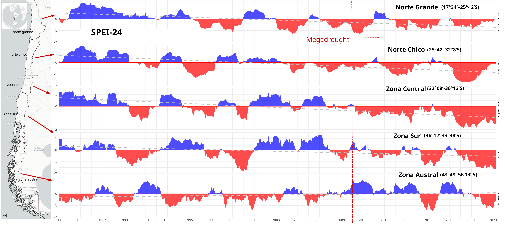
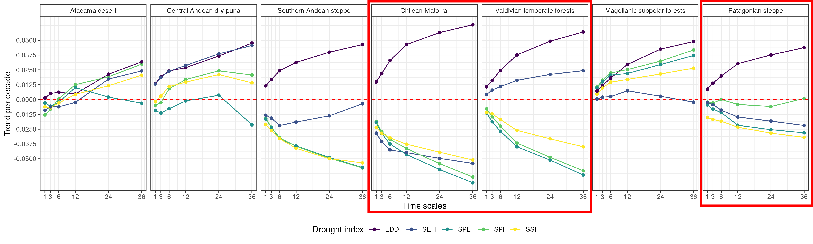
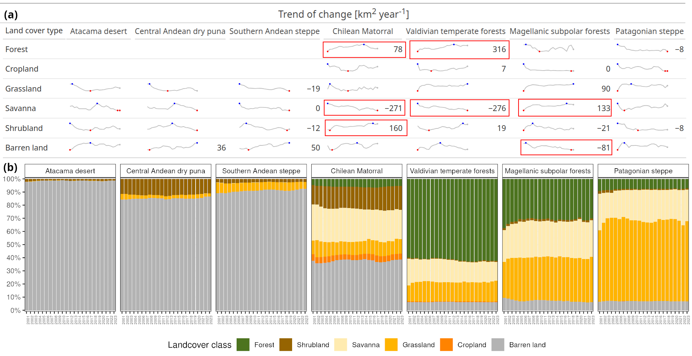
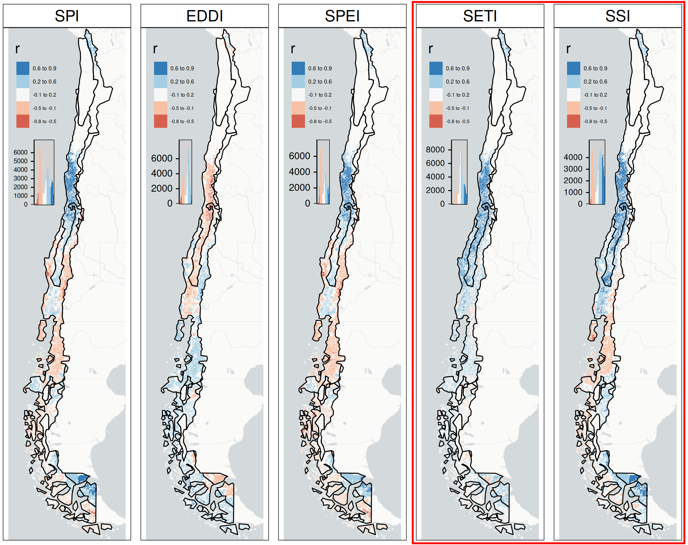
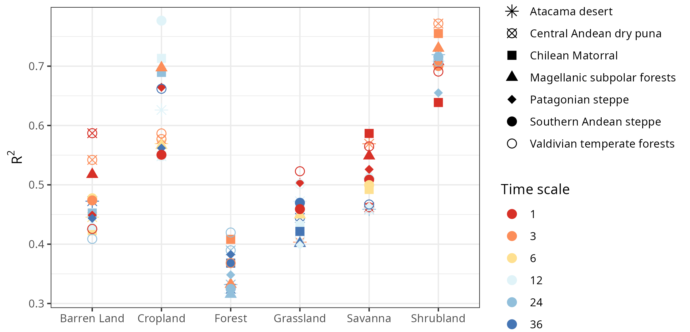
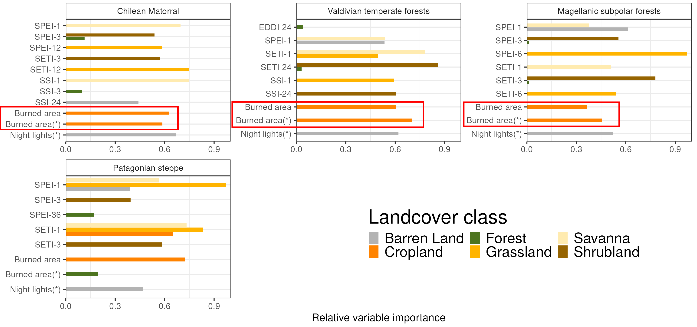

## Background & Motivation {.smaller background-image="img/egu25_logo.svg" background-position="97.5% 2.5%" background-size="7.5%" layout="true"}

::: {.columns}
::: {.column width=50%}
- Droughts are lasting longer, occurring more often, and intensifying [@IPCC2023].
- Chile megadrought [@Garreaud2017] and hyperdrought [@Garreaud2025].
- Severe effects on ecosystems, agriculture, and land cover.
- Need a full view: both water supply and demand matter.

:::
::: {.column width=50%}
![OpenAI. (2025). Image generated by ChatGPT [AI-generated image]. ChatGPT. https://chat.openai.com/](img/image_gpt_impactdrought.jpeg)
:::
:::

<!-- "Droughts are becoming more intense worldwide, reshaping ecosystems and agriculture. A complete analysis must consider both declining water supply and rising atmospheric demand." -->

---

## Research Objectives {background-image="img/egu25_logo.svg" background-position="97.5% 2.5%" background-size="7.5%" layout="true"}

- Assess drought `trends` over `short` (1 month) to `long` (36 months) time scales (multi-scalar drought).

- Analyze `multi-scalar` drought impacts on vegetation productivity.

- Analyze drought impacts on land cover trends and identify `main drivers`  across Chile.

<!-- "Our main goals were to capture how drought at different time scales impacts land productivity and land cover dynamics, and to identify the key drivers behind these transformations." -->

## Study Area {.smaller background-image="figs/mapa_area_estudio_final.png" background-position="95% 50%" background-size="contain" layout="true"}

::: {.columns}
::: {.column width=50%}
* Continental Chile divided into seven ecoregions
* `Ecoregions:` 
  - Atacama desert, 
  - Central Andean dry puna, 
  - Southern Andean steppe, 
  - [**Chilean Matorral**]{style="color:red;"}, 
  - [**Valdivian temperate forests**]{style="color:red;"}, 
  - Magellanic subpolar forests, and
  - [**Patagonian steppe**]{style="color:red;"} 

:::

::: {.column width=50%}
:::
:::

<!-- - **Description:** Continental Chile divided into seven ecoregions -->
<!-- - **Ecoregions:** Atacama desert, Central Andean dry puna, Southern Andean steppe, Chilean Matorral, Valdivian temperate forests, Magellanic subpolar forests, Patagonian steppe -->

---

## Methods  Overview {.smaller background-image="img/diagrama_egu2025.png" background-position="95% 50%" background-size="contain" layout="true"}

<!-- - `Frequency and time period:` monthly for 2000-2024 -->
<!-- - `Drought Indices:` SPI, SPEI, EDDI, SSI, SETI. -->
<!-- - `Vegetation Proxy:` zcNDVI from MODIS. -->
<!-- - `Land Cover Analysis:` MODIS (MCD12Q1) + Random Forest Models. -->
<!-- - `Multi-temporal assessment:` 1–36 months. -->

<!-- ??? -->
<!-- "We combined satellite-based drought indices and vegetation proxies to model ecosystem changes. Machine learning helped us disentangle drought effects from human impacts." -->

---

## Key Results: Water supply and demand trends {.smaller background-image="img/egu25_logo.svg" background-position="97.5% 2.5%" background-size="7.5%" layout="true"}

- Atmospheric demand (EDDI) increasing.
- Water supply (SPI, SPEI, SSI) decreasing.
- Vegetation water demand (SETI) dropping in water-limited regions.
- Chilean Matorral and Patagonian Steppe drying rapidly.

{fig-align='center'}

<!-- ??? -->
<!-- "Some regions like the Matorral are facing a double hit: less rain and more atmospheric thirst. Vegetation can't keep up, even when atmospheric demand rises." -->

---

## Key Results: Land cover changes {.smaller background-image="img/egu25_logo.svg" background-position="97.5% 2.5%" background-size="7.5%" layout="true"}

::: {.columns}
::: {.column width=20%}
- Shrublands and forests expanding.
- Savannas shrinking.
- Forest area increasing moderately, but with uncertainties.

:::
::: {.column width=80%}
{fig-align='center'}
:::
:::

## Drought impacts on vegetation productivity {.smaller background-image="img/egu25_logo.svg" background-position="97.5% 2.5%" background-size="7.5%" layout="true"}

{fig-align='center'}

<!-- ??? -->
<!-- "As drought intensifies, shrublands are expanding while savannas are shrinking. Forest area shows moderate growth, though the type and health of forests need further assessment." -->

---

## RF model for land cover trend {.smaller background-image="img/egu25_logo.svg" background-position="97.5% 2.5%" background-size="7.5%" layout="true"}

- The models for shrublands and croplands explain higher variance.

{fig-align='center'}

## Drivers of Land Cover Change {.smaller background-image="img/egu25_logo.svg" background-position="97.5% 2.5%" background-size="7.5%" layout="true"}

- `Short-term` `SETI` and `SPEI` are the most important variables explaining the trends on `shrublands`, `grasslands`, and `savannas`.
- `Fires` influence cropland shifts.
- `Night lights` are asociated to `barren land` trends.

{fig-align='center'}

<!-- ??? -->
<!-- "Drought indices related to water demand and soil moisture are powerful predictors of land cover changes, particularly for shrublands and croplands." -->

---

## Key takeaways {.smaller background-image="img/egu25_logo.svg" background-position="97.5% 2.5%" background-size="7.5%" layout="true"}

In Chile:

- Trends in `water supply decline` in most of the country and trends in `AED increase` are observed.

- In `water-limited` regions, the trends on `SETI decrease`.

- `Drought` reshapes `ecosystems` deeply and persistently.

- Context-specific adaptation strategies are urgent for conservation, agriculture, and land management.

<!-- ??? -->
<!-- "Persistent droughts are not just stressing ecosystems — they are transforming them. Building resilience requires urgent, localized strategies for land and water management." -->

# Thank you! {background-image="img/egu25_logo.svg" background-position="97.5% 2.5%" background-size="7.5%" layout="true"}

**Questions?**

# Referenes {background-image="img/egu25_logo.svg" background-position="97.5% 2.5%" background-size="7.5%" layout="true"}

::: {#refs}
:::
